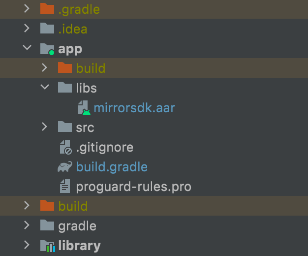
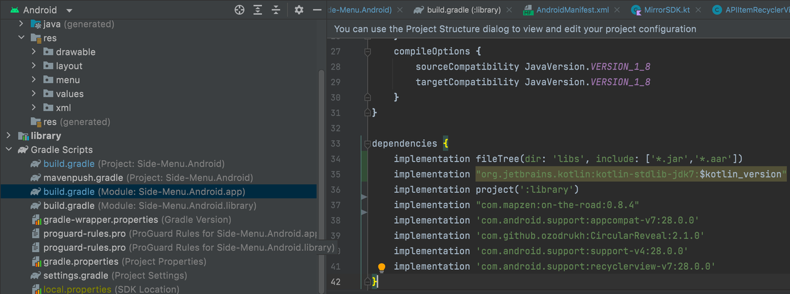

# MarketSDK安卓接入文档

最新版本为: 0.1.0  
更新时间为: 2022-08-08

## 导入SDK
*提示  
Android SDK 要求最低系统版本为 Android 4.4
Android SDK ( aar 格式) 大小约为 16 KB*
1. 下载并解压 [Android SDK](https://games.mirrorworld.fun/market_sdk/mirrorsdk.aar)  
2. libs 文件夹(如果目录下没有则需手动创建）中添加 MirrorSDK.aar
   
3. 在 build.gradle 添加如下配置
   dependencies {
   implementation fileTree(dir: 'libs', include: ['*.jar','*.aar'])
   }
   

## 初始化SDK
1. 设置AppID  
   在MirrorSDK中，使用MirrorSDK单例来管理所有SDK的方法:
   在Java中，请使用MirrorSDK.Companion.get()来获得单例句柄；
   在Kotlin中，请使用MirrorSDK.instance来获得单例句柄。
   在调用其他API前，调用SetAppID方法来设置App的AppID。
   MirrorSDK.Companion.get().SetAppID(mContext,"YourAppID");

2. 初始化SDK  
   创建 LogtoClient 前，需要确保 Application 已经初始化。
   调用InitSDK(Context)方法对SDK进行初始化，并传入上下文参数。

3. 引导用户登录  
   要使用MirrorSDK提供的接口服务，需要先引导用户进行登录流程以便SDK能够获取token。
   建议将登录操作纳入目标应用，并作为用户登录应用的必要步骤之一。
   调用StartLogin方法开始SDK的登录流程。
   MirrorSDK.Companion.get().StartLogin(mContext);
   在之后的与SDK的互动中，如果用户没有正确地进行过登录，将会自动弹出登录界面引导用户登录（但这对用户是不友好的，强烈建议将登录流程集成入App的使用流程中）。

4. 调用MirrorSDK提供的服务接口  
   当完成以上步骤后，即可直接调用SDK提供的各个接口获取服务。
   详见官网SDK接口列表。

## Java导入Kotlin环境支持
由于SDK为Kotlin编写，如果项目为Java编写，则需要对环境作出修改，使之支持Kotlin代码。